# 1984.1
### 🔗 Live Site
[view the deplyed site here](#)

**1984.1** is a satirical website, that explores the relevance of George Orwell's *1984* in today's society, specifically through the lens of modern-day London. It guides users through themes such as surveillance, propaganda, and thought control using humour, visual design and interactive storytelling.

The site is designed for users who want a thought-provoking yet entertaining way to reflect on how dystopian concepts have been repackaged as everyday conveniences in the digital age. It encourages critical thinking about technology, privacy, and media - without taking itself too seriously.

### 🖼️ Site Preview
> _add a screenshot of the site showing desktop, tablet and mobile views_

### [Contents](#)
- [User Goals](#user-goals)
- [User Stories](#user-stories)
- [Website Goals & Objectives](#website-goals--objectives)
- [Wireframes](#wireframes)
- [Design Choices](#design-choices)
  - [Typography](#typography)
  - [Colour Scheme](#colour-scheme)
  - [Responsiveness](#responsiveness)
  - [Images](#images)
- [Features](#features)
  - [Navigation](#navigation)
  - [Footer](#footer)
  - [Hero Section](#hero-section)
  - [Webite Intro](#website-intro)
  - [Main Navigation Grid](#main-navigation-grid)
  - [Testimonials Carousel](#testimonials-carousel)
  - [Newsletter Signup Form](#newsletter-signup-form)
- [Additional Pages](#additional-pages)
  - [Surveillance Page](#surveillance-page)
  - [Housing Page](#)
- [Technologies Used](#technologies-used)
  - [Languages](#languages)
  - [Libraries & Frameworks](#libraries-&-frameworks)
  - [Tools](#tools)
- [Testing](#testing)
  - [Bugs Fixed](#bugs-fixed)
  - [Responsiveness Tests](#responsiveness-tests)
  - [Code Validation](#code-validation)
    - [HTML](#html)
    - [CSS](#css)
  - [User Story Testing](#user-story-testing)
  - [Feature Testing](#feature-testing)
  - [Accessibility Testing](#accessibility-testing)
  - [Lighthouse Testing](#lighthouse-testing)
  - [Browser Testing](#browser-testing)
- [Deployment](#deployment)
  - [How to Deploy the Project](#how-to-deploy-the-project)
  - [How to Fork the Project](#how-to-fork-the-project)
  - [How to clone the Project](#how-to-clone-the-project)
- [Credits](#credits)

## User Goals
- Navigate the site easily with user-friendly, intuitive structure.
- Engage with content against a clean, non-distracting background.
- Understand Orwellian concepts of surveillance, censorship, and misinformation, and how they relate to today's society.
- Explore Orwellian themes in a creative, humourous, and engaging format.
- Reflect on their own and society's relationship with technology and authority through satire.
- Use the site as a resource for teaching, learning, research, or creative inspiration.
- Appreciate thoughtful design that enhances storytelling and concept delivery.

## User Stories
- As a user, I want to navigate the site with ease so that I can find content without friction or confusion.
- As a user, I want the background to be clean and minimal so I can focus on the content without distractions.
- As a user, I want to understand how Orwell's themes relate to today's society so I can make meaningful connections between fiction and reality.
- As a user, I want to explore Orwell's themes in a humorous and engaging way so that learning feels enjoyable. 
- As a user, I want the site to prompt reflection on my relationship with technology and authority so I can analyse my own reliance from a new perspective in a *light-hearted way*. 
- As a user, I want use the site as a creative teaching or research tool so I can explain or explore *1984* in a different format.
- As a user, I want the design to include thoughtful visuals so I can see how design enhances storytelling and concept delivery.

## Website Goals & Objectives
**Primary Goals:**
  - Create a responsive, accessible, and user-friendly experience.
  - Design consistent layout and reusable components across muliple pages and/or sections.
  - Ensure performance, usability, and mobile responsiveness.
  - Engage users with thought-provoking content and creative visuals.
  - Present Orwellian themes through a modern, satirical lens.
  - Encourage light-hearted reflection on surveillance, censorship, and digital obedience.
  - Showcase front-end development and UX storytelling skills.

**Secondary Goals:**
  - Maintain a tone that educates whilst entertains.
  - Support use in educational or classroom settings.
  - Create a project that demonstrates narrative and technical skills.
  - Keep the site scalable for future additions (e.g. new sections or interactive features).

  ## Wireframes
  To plan the structure and layout of the site, I created fow-fidelity wireframes using **Figma**. My process began with a **mobile-first design**, ensuring responsiveness and usability on smaller screeens before scaling up. I then adapted the layouts for **tablet** and finally for **laptop/desktop** viewports, making design choices that preserve visual hierachy and accessibility across all devices.

  [Mobile wireframes](assets/docs/mobile-wf.png)

  [Tablet wireframes](assets/docs/tablet-wf.png)

  [Laptop wireframes](assets/docs/desktop-wf.png)

  ## Design Choices
  The design 1984.1 was guided by the project's satirica tone and its central theme: a modern dystopia rooted in everyday London. Each visual choice - from colours and typography to layout and imagery - was made to reinforce the atmosphere of institutional control, passive surveillance, and curated obedience, while ensuring readability and responsive ness across aall devices.

  These choices reflect the design intent at the start of development and may be refined further based on how they perform on the live site.

  ### Typography
  **Headings:** *Unioca One* - chosen for its rigid, institutional feel, evoking the aesthetic of public notices and government-issued warnings.

  **Body Text:** *Inter* - selected for its clean, modern readability and versatility across devices, supporting long-form critical copy without distraction.

  The typography aims to reflect the visual language of public sector communication, reinforcing the site's satirical tone.

  To optimise performance:
  - Fonts are loaded using a `<link>` in the HTML `<head>` instead of `@import`, which improves page rendering speed.
  - Added `rel="Preconnect"` directives for Google Fonts domains to reduce DNS lookup time and latency during font loading.

  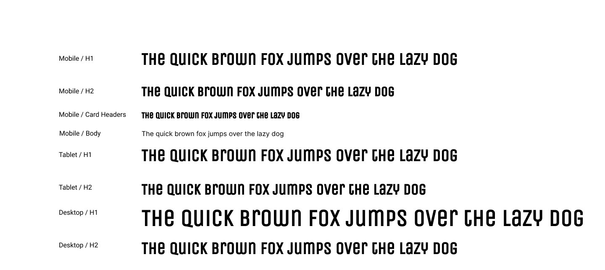

  ### Colour Scheme
  A limited 5-colour palette was used to create a stark, modernist aesthetic. The colours were chosen to reflect both the physical urban environment of London and the emotional tone of passive control. I used [Coolers](https://coolors.co/) to explore combinations and define a cohesive colour palette.

  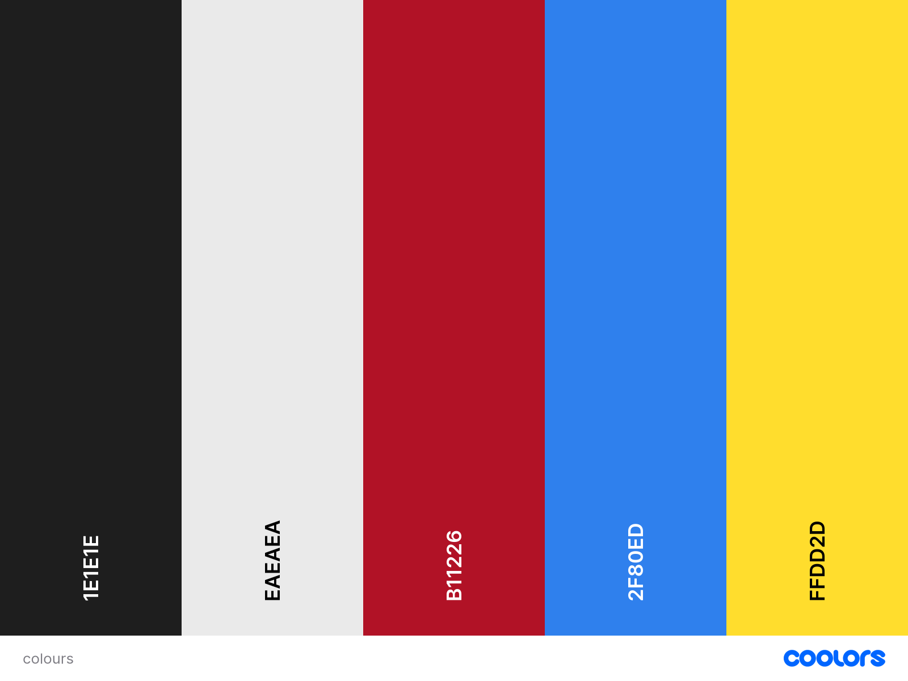

  ### Responsiveness
  To ensure the site worked effectively across all devices, I followed a **mobile-first approach**, starting with wireframes for small screens and scaling up to tablet and desktop.

  I used **Relume's layout library for inspiration** for designing my wireframes. All layouts were custom built and adapted to fit the tone, content, and style of 1984.1

  ### Images
  > _add image design choices_

## Features
### Navigation
- Designed a responsive dark mode navigation bar using Bootstrap.
- Navigation bar includes, site logo, navigation links, and a CTA button.
- Uses keyboard-friendly markup for accessibility (`tab` and `enter` supported).
- Full link functionality will be completed during development.

Mobile Navigation Bar

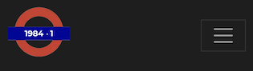

Desktop Navigation Bar

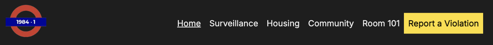

### Footer
- A fully responsive dark footer was designed using Bootstrap to adapt seamlessly across mobile, tablet, and desktop devices.
- The footer includes key site element: the 1984.1 logo, a compliance themed message, accessible social media links, and main navigation links.
- Leagal links(Terms of Obedience, Data Surrender Policy, Cookie Notice) are presented inline on larger screens for ease of access and staack vertically on smaller devices for clarity.
- The layout transitions from a single-column structure on mobile to a two-column grid on desktop, maintaining readability and alignment.
- All elements follow accessibility best practices, including sematic HTML, keyboard navigation, and compliant colour contrast ratios.

Mobile Footer

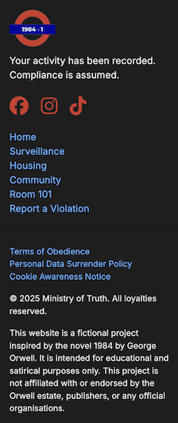

Desktop Footer

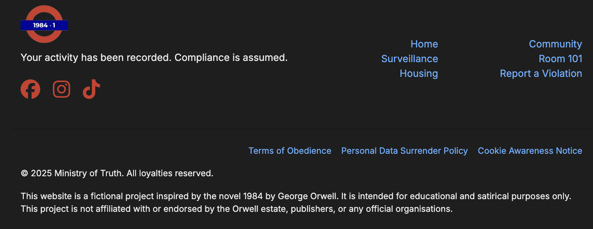

### Hero Section
- The hero section introduces the site's satirical tone and central theme with a bold multi-line dark humour subheading, and lead paragraph followed by a prominent call-to-action (CTA).
- Designed using Bootstrap's grid system with a mobile-first layout that stacks content vertically, and transitions to a two-column layout (lg and up) with text on the left and imagery on the right.
- The CTA bullon is full-width on mobile, and auto-width on larger screens for responsiveness and accessibility.
- The featured image (London skyline) is diplayed responsively using `.img-fluid` and has been optimised in both file format and resolution:
  - Converted to WebP to reduce load time
  - Served at 2x the display size to ensure sharp rendering on retina/high DPI displays
  - Styled with a subtle grayscale and contrast filter, plus a soft yellow glow (box-shadow) to create a graphic novel aesthetic.
- All elements are semantically structured, fully keyboard-accessible, and pass Lighthouse's contrast and responsive image checks.
- HTML and CSS has been refactored for claritty, maintainability, and visual cohesion with the rest of the site.

Mobile Hero Section

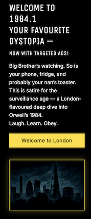

Desktop Hero Section

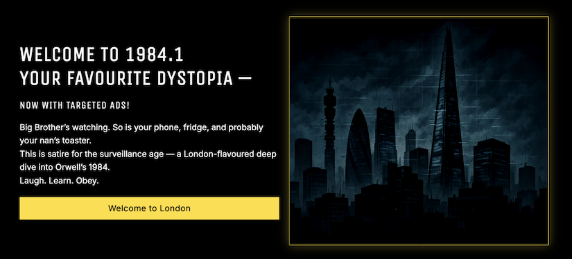

### Website Intro - Citizen Briefing Document
- Presents the website'z satirical premise with a strong narrative hook and dystopian visual.
- Built with a full-width **Bootstrap card** and a `.card-img-overlay` layout.
- Features a stylised heading, structured prargraphs, and a strong closing message - all centrally aligned using Flexbox.
- Background image (WebP) is in a graphic novel style, and fully responsive using `object-fit: cover;` - scales appropiately via media queries.
- Padding and text alignment are optimised across breakpoints for readability and emphasis.
- Semantic HTML structure enhances accessibility, with descriptive aria-label set on the card for screen readers.
- Visual and typographic consistency maintained with the rest of the homepage to preseve tone.
- Designed to retail both legibility and narrative impact across devices without introducing layout shifts.

Mobile Citizen Briefing Document

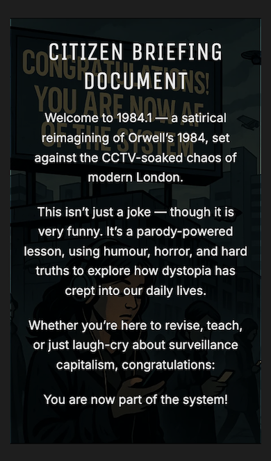

Desktop Citizen Briefing Document

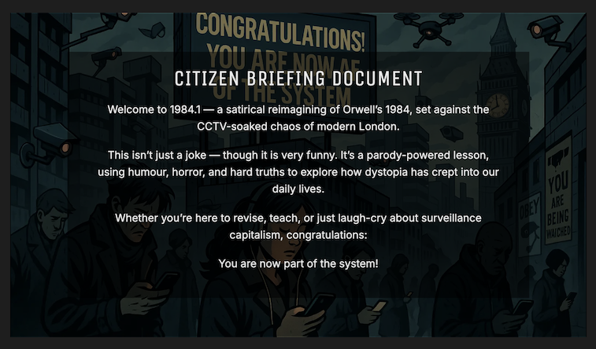

### Main Navigation Grid
- A responsive 4-card grid built with Bootstrap's grid system.
- Displays satirical content categories: **Surveillance, Housing, Community,** and **Room 101** - each with themed icons, humour-infused descriptions, and custom call-to-action links.
- Layout adjusts based on screen size:
  - Full width on mobile
  - Two-column on tablets
  - Four-column on desktops
- Cards are styled with high-contrast black/yellow colour palette and consistent typefaces to reflect the Orwellian theme.
- Fully keyboard navigable, with accessible colour contrast and sematic heading structure.

Mobile Indoctrination Tiles Grid

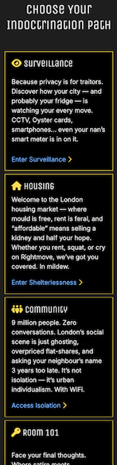

Tablet Indoctrination Tiles Grid

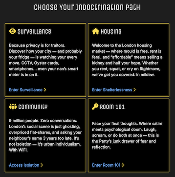

Desktop Indoctrination Tiles Grid

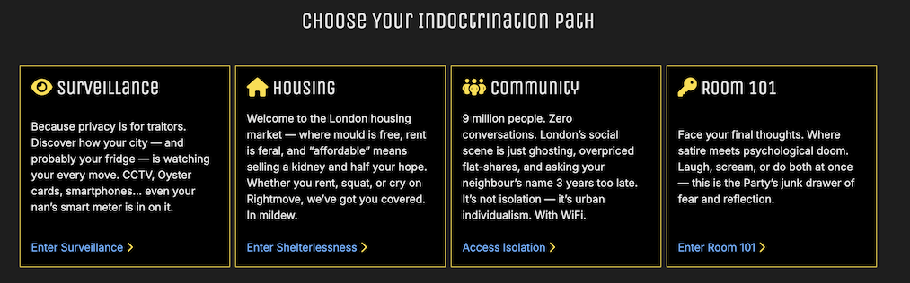

### Testimonials Carousel
- A satirical testimonial section built using the **Bootstrap 5 carousel component**.
- Displays rotating citizen "quotes" that reflect the tone of **state-approved praise**, parodying dystopian propaganda.
- Carousel include **three rotating testimonials**, each housed in a centred `<blockquote>` with contrasting styling.
- The responsive design adapts the carousel layout and spacing across screen izes using Bootstrap's grid classes and utility spacing.
- Typography and colours align with the dystopian branding, and testimonial metadata is styled as a **mock citizen ID**

Mobile Testimonial Carousel

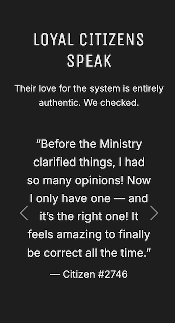

Desktop Testimonial Carousel

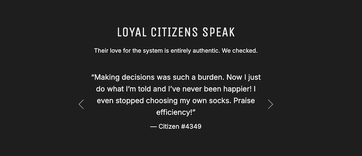

### Newsletter Signup Form
- A custom **newsletter subscription card** styled to match the site's dystopian theme using a high-contrast black and yellow palette.
- Includes a satirical prompt reminding users that "we promise not to sell your data to *more* corporations than necessary."
- Uses a standard **Bootstrap form** layout with accessibility enhancements:
  - Hidden `<label>` for screen readers
  - Custom `aria-describedby` help text
  - Responsive spacing and full-width layout on mobile
- Placeholder text and instructional copy reinforce the site's theme of compliance and indoctrination.
- Input field, help text, and submit button are custom-styled for brand consistency.
- The form is currently frontend-only (no backend integration) and serves as a design element rather than a functioning data collector.

Mobile Newsletter Signup Form

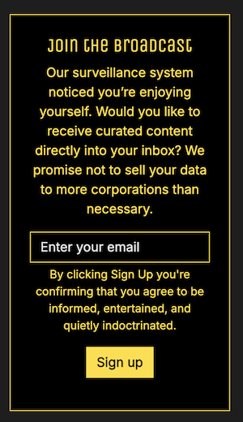

Desktop Newsletter Signup Form

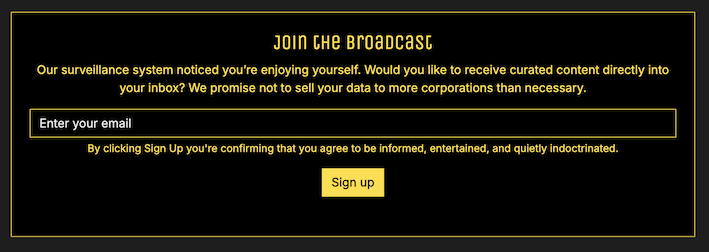

### Mailing List Confirmation Modal
- **Purpose**: Confirms successful newsletter signup with satirical flair.
- **Trigger**: Activated when a user submits their email through the newsletter form.

- **Design**:
  - Dark Bootstrap modal matching the site's theme.
  - Contains a parody "Ministry Notice" confirming the user's increased loyalty and subscription success.
  - Reinforces brand tone with lines like "Please read with compliance and a hot beverage."

- **Accessibility**:
  - Includes aria-labelledby and aria-hidden for screen reader compatibility.
  - Uses Bootstrap's accessible modal structure.

- **Close Options**:
  - Includes both a top-right dismiss (X) and a "Close" button with the site's CTA style.

Join the Broadcast Modal

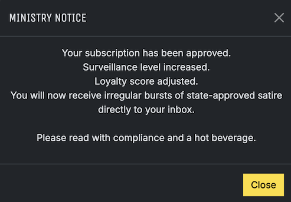

## Additional Pages
### Surveillance Page
The surveillance page explores the theme of digital monitoring in modern London, using satire to highlight the parrallels between 
Orwell's 1984 and our everyday tech habits.

**Key Features**

- **Hero Section with Custom Background**

  A full-width header built using custom CSS background styling wth a dark overlay for contrast and accessibility. Replaces the Bootstrap card used on the homepage intro for improved performance and Largest Contentful Paint (LCP) optimisation.

- **Responsive Content Blocks**

  A series of satirical content sections styled with Bootstrap's grid system. Each block features humourous observations on smart devices, location tracking, and voice assistants. Layout stacks on mobile and displays as two columns on tablet and desktop.

- **Custom Blockquote Styling**

  Includes a citizen "quote" styled with `<blockquote>`, Font Awesome icons for oversized quotation marks, and custom CSS for drop shadows, colour, and position. Adds a layer of visual interest and brand tone.

- **Closing Satirical Paragraph**

  Ends the page with a paragraph styled over a CSS background image (street-level CCTV view) and high-contrast text. Delivered as a parody of official messaging, it reflects on public surveillance with humour and unease.

- **Mobile-First Responsive Design**

  The entire page adapts fluidly across devices. All elements follow semantic HTML, meet WCAG contrast guidelines, and are optimised for performance and accessibility.

[View the Surveillance Page](https://creatvie-introvert.github.io/1984-1/surveillance.html)

Mobile View

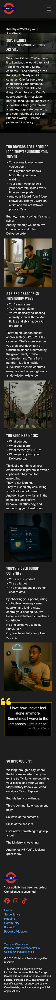

Desktop View

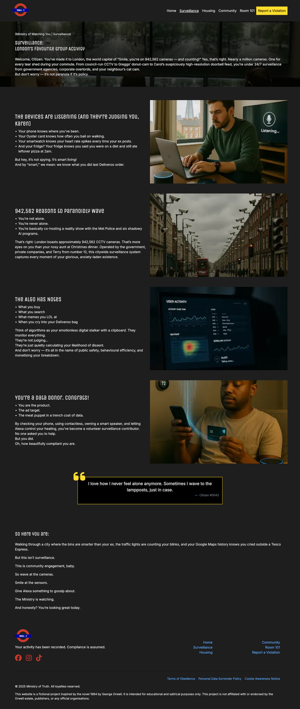

### Housing Page
The Housing page exposes the satirical horros of Londonn's rental market, parodying the bleak realities of overpriced, under-maintained living conditions with an Orwellian twist.

**Key Features**:

- **Hero Section with Custom Background**

  Background image added via custom CSS with a dark overlay to maintain contrast and focus on the text. This section introduces the tone with: "Where Rent Is High and Morals Are Low."

- **"Comfort, Cost, and Dignity Don't Coexist" Section**

  This section features a centred heading and subheading, highlighting the impossible trade-offs of renting in London. This is followed by a **4-card grid** satirising various housing struggles:
    - *Your Landlord Is Not You Friend*
    - *Ownership? Good One*
    - *Living Conditions: Rustic Misery*
    - *Renting: A Subscription to Exist*
  Each card includes a humourous image in sepia-toned graphic style with accompanying text and alt attributes for accessibility. The grid layout adapts resposively for mobile, tablet, and desktop using Bootstrap's grid system.

- **Closing Statement**

  A styised concluding paragraph with dry wit, and a background image with dark overlay, styled with custom CSS.

- **Accessibility & Responsiveness**
  - Fully mobile-first responsive, created using Bootstrap.
  - Semantic HTML, ARIA attributes, and descriptive `alt` text included.
  - Colour contrast and image scaling test acrss screen sizes.

Mobile View

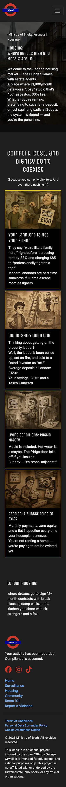

Desktop View

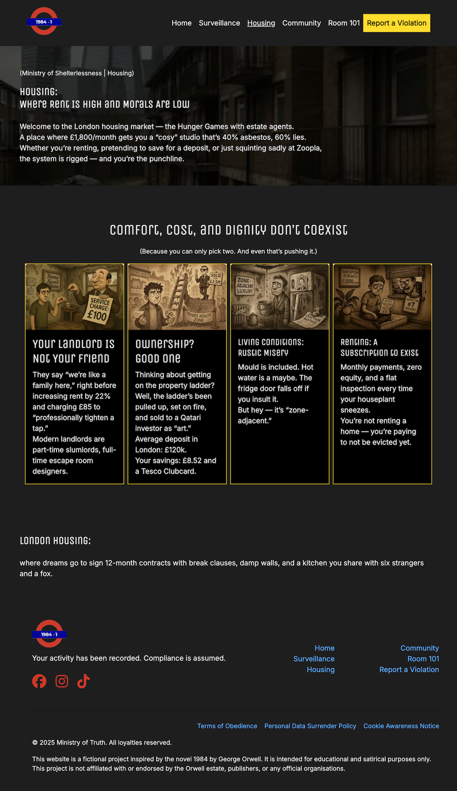

## Technologies Used
### Languages
### Libraries & Frameworks
### Tools
- Visual Studio: deveopment
- Sora: for image generation
- ChatGPT: for content creation
- Squoosh: for image optimisation

## Testing
### Bugs Fixed

| Bug Description                                  | Solution Implemented                                                                 |
|--------------------------------------------------|----------------------------------------------------------------------------------------|
| Logo displayed twice in navbar                  | Removed duplicate markup causing the second logo to appear.                          |
| Mobile navigation layout broken                 | Adjusted Bootstrap grid and spacing to stack elements correctly on small screens.    |
| Improper image aspect ratio (Lighthouse error)  | Added `aspect-ratio` and `object-fit` via media queries to maintain proportions.     |
| Low-resolution image served                     | Re-exported hero image in WebP format at a higher resolution (1200x800).             |
| Footer links misaligned on medium screens       | Used responsive columns and alignment utilities to correct layout.                   |
| Social icons stacked vertically                 | Implemented flex layout with gap to align social icons horizontally.                 |
| Font import blocking render                     | Replaced CSS `@import` with HTML `<link>` and added `preconnect` hints.              |
| Contrast accessibility issues                   | Changed text and link colors to meet WCAG 2.1 contrast ratio standards.              |
|Eliminate render-blocking resources|Optimised Google Fonts Loading, defer all script loading, preload Bootstrap CSS file and custom CSS file|
|Properly size images|Applied `img-fluid w-100`, and updated sizes, width, and height attributes to allow responsive scaling|
|Carousel buttons not scrolling|Updated the `data-bs-target` on the button to ensure they matched the `id`|
 

### Responsiveness Tests
### Code Validation
#### HTML
#### CSS
### User Story Testing
#### Feature Testing
#### Accessibility Testing
#### Lighthouse Testing
Performance testing was carried out using Lighthouse in Chrome DevTools.

#### Browser Testing
### Deployment
#### How to Deploy the Project
#### How to Fork the Project
#### How to clone the Project
## Credits