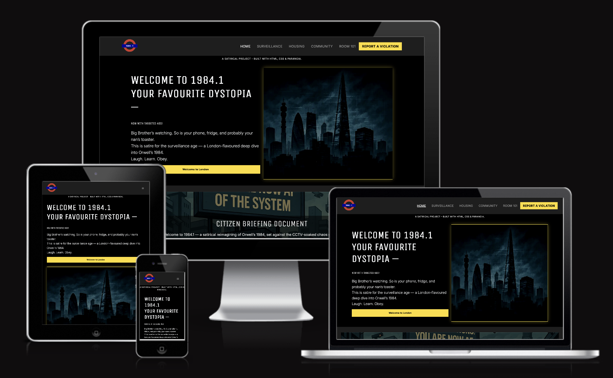
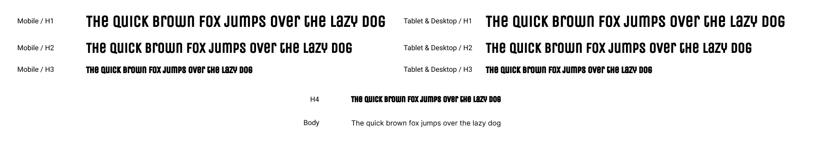
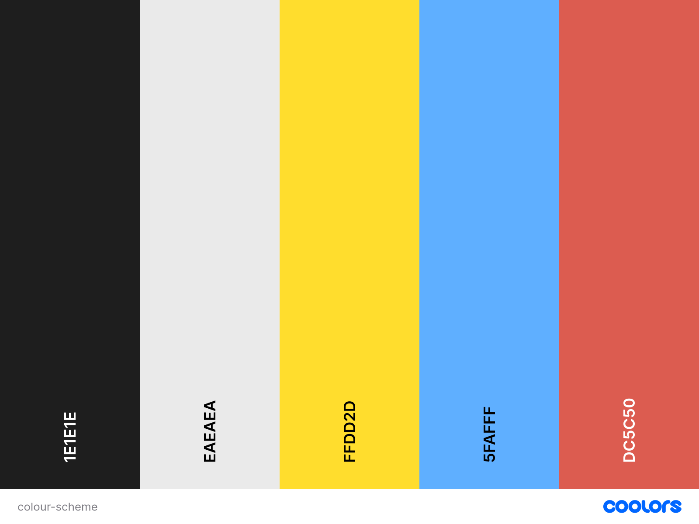

# 1984.1
### 🔗 Live Site
[view the deplyed site here](https://creatvie-introvert.github.io/1984-1/)

**1984.1** is a satirical website, that explores the relevance of George Orwell's *1984* in today's society, specifically through the lens of modern-day London. It guides users through themes such as surveillance, propaganda, and thought control using humour, visual design and interactive storytelling.

The site is designed for users who want a thought-provoking yet entertaining way to reflect on how dystopian concepts have been repackaged as everyday conveniences in the digital age. It encourages critical thinking about technology, privacy, and media - without taking itself too seriously.

### 🖼️ Site Preview

### [Contents](#)
- [User Goals](#user-goals)
- [User Stories](#user-stories)
- [Website Goals & Objectives](#website-goals--objectives)
- [Wireframes](#wireframes)
- [Design Choices](#design-choices)
  - [Typography](#typography)
  - [Colour Scheme](#colour-scheme)
  - [Responsiveness](#responsiveness)
  - [Images](#images)
- [Features](#features)
  - [Navigation](#navigation)
  - [Footer](#footer)
  - [Hero Section](#hero-section)
  - [Webite Intro - Citizen Briefing Document](#website-intro---citizen-briefing-document)
  - [Main Navigation Grid](#main-navigation-grid)
  - [Testimonials Carousel](#testimonials-carousel)
  - [Newsletter Signup Form](#newsletter-signup-form)
  - [Newsletter Signup Confirmation Page - Join the Broadcast Confirmation](#newsletter-signup-confirmation-page---join-the-broadcast-confirmation)
- [Additional Pages](#additional-pages)
  - [Surveillance Page](#surveillance-page)
  - [Housing Page](#)
- [Technologies Used](#technologies-used)
  - [Languages](#languages)
  - [Libraries & Frameworks](#libraries-&-frameworks)
  - [Tools](#tools)
- [Testing](#testing)
  - [Bugs Fixed](#bugs-fixed)
  - [Responsiveness Tests](#responsiveness-tests)
  - [Code Validation](#code-validation)
    - [HTML](#html)
    - [CSS](#css)
  - [User Story Testing](#user-story-testing)
  - [Feature Testing](#feature-testing)
  - [Accessibility Testing](#accessibility-testing)
  - [Lighthouse Testing](#lighthouse-testing)
  - [Browser Testing](#browser-testing)
- [Deployment](#deployment)
  - [How to Deploy the Project](#how-to-deploy-the-project)
  - [How to Fork the Project](#how-to-fork-the-project)
  - [How to clone the Project](#how-to-clone-the-project)
- [Credits](#credits)

## User Goals
- Navigate the site easily with user-friendly, intuitive structure.
- Engage with content against a clean, non-distracting background.
- Understand Orwellian concepts of surveillance, censorship, and misinformation, and how they relate to today's society.
- Explore Orwellian themes in a creative, humourous, and engaging format.
- Reflect on their own and society's relationship with technology and authority through satire.
- Use the site as a resource for teaching, learning, research, or creative inspiration.
- Appreciate thoughtful design that enhances storytelling and concept delivery.

## User Stories
- As a user, I want to navigate the site with ease so that I can find content without friction or confusion.
- As a user, I want the background to be clean and minimal so I can focus on the content without distractions.
- As a user, I want to understand how Orwell's themes relate to today's society so I can make meaningful connections between fiction and reality.
- As a user, I want to explore Orwell's themes in a humorous and engaging way so that learning feels enjoyable. 
- As a user, I want the site to prompt reflection on my relationship with technology and authority so I can analyse my own reliance from a new perspective in a *light-hearted way*. 
- As a user, I want use the site as a creative teaching or research tool so I can explain or explore *1984* in a different format.
- As a user, I want the design to include thoughtful visuals so I can see how design enhances storytelling and concept delivery.

## Website Goals & Objectives
**Primary Goals:**
  - Create a responsive, accessible, and user-friendly experience.
  - Design consistent layout and reusable components across muliple pages and/or sections.
  - Ensure performance, usability, and mobile responsiveness.
  - Engage users with thought-provoking content and creative visuals.
  - Present Orwellian themes through a modern, satirical lens.
  - Encourage light-hearted reflection on surveillance, censorship, and digital obedience.
  - Showcase front-end development and UX storytelling skills.

**Secondary Goals:**
  - Maintain a tone that educates whilst entertains.
  - Support use in educational or classroom settings.
  - Create a project that demonstrates narrative and technical skills.
  - Keep the site scalable for future additions (e.g. new sections or interactive features).

  ## Wireframes
  To plan the structure and layout of the site, I created fow-fidelity wireframes using **Figma**. My process began with a **mobile-first design**, ensuring responsiveness and usability on smaller screeens before scaling up. I then adapted the layouts for **tablet** and finally for **laptop/desktop** viewports, making design choices that preserve visual hierachy and accessibility across all devices.

  [Mobile wireframes](docs/mobile-wf.png)

  [Tablet wireframes](docs/tablet-wf.png)

  [Laptop wireframes](docs/desktop-wf.png)

  ## Design Choices
  The design of 1984.1 was guided by the project's satirical tone and its central theme: a modern dystopia rooted in everyday London. Each visual choice - from colours and typography to layout and imagery - was made to reinforce the atmosphere of institutional control, passive surveillance, and curated obedience, while ensuring readability and responsiveness across all devices.

  During the development, some initial design elements - particularly images - were changed to better align with the final tone and layout of the site. These updated visuals more effectively support the storytelling and aesthetic goals of the project.

  This section reflects the design decisions currently implemented on the live site and may contiue to evolve through user feedback and ongoing post-launch improvements.

  ### Typography
  **Headings - *Unioca One*** 

  Chosen for its bold, rigid style that echoes the cisual tone of public notices, government signage, and institutional messageing. It reinforces the satirical undertone by mimicking the cold authority of bureaucratic communication.

  **Body Text - *Inter***

  Selected for its clean, modern readability, modern design, and clean geometry. Inter supports the site's long-form content and adapts well across screen sizes, maintaining clarity without visual clutter.

  **Purpose & Performance**

  The combination of Unica One and Inter reflecrs the visual language of public sector materials, aligning with the site's parodty of controlled communication. To ensure performance and reduce load times, fonts are imported using `@import` from \Google Fonts.

  

  #### Font Usage Table
  |CSS Name|Font Name|Use Case Description|
  |--------|---------|--------------------|
  |--font-body|Inter|Used for paragraphs, buttons, forms, and navigation links to ensure clarity and consistency.|
  |--font-heading|Unica One|Used for all main headings to evoke insitutional/public signage.|

  ### Colour Scheme
  A limited 5-colour palette was used to create a stark, modernist aesthetic. The colours were chosen to reflect both the physical urban environment of London and the emotional tone of passive control. I used [Coolers](https://coolors.co/) to explore combinations and define a cohesive colour palette.

  

  |CSS Variable|Hex Code|Usage Description|
  |------------|--------|-----------------|
  |`--page-bg` |`1E1E1E`  |Background colour of the page|
  |`--primary-text`|`EAEAEA`|Default body text colour|
  |`--cta-text`|`000000`  |Call-to-action text colour; used in buttons and highlighted UI elements|
  |`--link-text`|`5FAFFF` |Standard link colour|
  |`--alerts`|`CF382A` |Used for warning or error messages and helper text|
  |`--ctas-highlight`|`FFDD2D`|Button background, highlight accents, and hover states for interactive elements|

  ### Responsiveness
  To ensure the site worked effectively across all devices, I followed a **mobile-first approach**, starting with wireframes for small screens and scaling up to tablet and desktop.

  I used **Relume's layout library for inspiration** for designing my wireframes. All layouts were custom built and adapted to fit the tone, content, and style of 1984.1

  ### Images
  The imagery in 1984.1 plays a critical role in reinforcing the site's satirical tone and dystopian message. All images were selected or generated to resemble propaganda posters, government-issued warnings, and comic-style artwork that exaggerates modern anxieties.

  **Design Intent**:
  - **Style**: Stylised, high-contrast illustrations with bold lines and muted or limited colour palettes to evoke feelings of control, surveillance, and psychological strain.
  - **Themes**: Each image aligns with a core theme - such as housing inequality, social isolation, or mass surveillance - and often includes exaggerated or surreal elements to heightn the satire.
  - **Accessibility**: All images include descriptive `alt` text that communicates both the visual content and the satirical intent for screen reader users.
  - **Optimisation**: Images are served in .webp format to balance visual quality and performance, keeping load times minimal across devices.

  This approach ensures the visual content doesn't just decorate the site - it deepens the narrative and experience.

## Features
The **1984.2** website includes a range of features designed to support its satirical tone, reinforce its dystopian narrative, and ensure accessibility across all devices. Each section was deliberately styled to reflect the aesthetic of institutional messaging, urban surveillance, and controlled user experience.

### Responsive Layout
This site uses a responsive grid system powered by Bootstrap 5, with custom media queries to handle layout transitions across mobile, tablet, and desktop breakpoints. Elements stack or align as needed for seamless user navigation.

Responsive layout on Mobile, Tablet, and Desktop

### Navigation
A sticky top navigation bar ensures users can quickly jump between site sections. It is fully responsive and collapses into a hamburger menu on smaller screens.

Sticky responsive navigation bar

### Footer
The footer is informative nd functional. It incldes key navigation links, social media icons, legal dislaimers, and a satirical compliance message. Designed to remain visually balanced witht he rest of the layout, it adapts to various screen sizes.

Custom responsive footer with compliance message

### Hero Section
The hero section serves as the site's bold introduction, immediately establishing its satirical tone and dystopian theme. It features a prominent, multi-line heading with a subheading styled as a smaller `<small>` tag, delivering dark humour through phases like *"Now With Targeted Ads!"* Below this, a lead paragraph reinforces the parody with references to modern surveillance culture, setting the stage for the site's narrative. A clear call-to-action button (*"Welcome to London"*) is places beneath the text, styled as a large Bootstrap button that spans the full-width on smaller screens `w-100` and adjusts to auto width on larger ones `w-md-auto` for responsiveness and accessibility. Structurally, the section is built using Bootstrap's grid system: a singlerow aligns the content vertically on mobile and transitions to a two-column ;ayout on larger viewports `col-12` and `col-ld-6`. The right-hand column contains an optimised `.img-fluid` image of a comic-style illustration of London's skyline, in .webp format for responsiveness and performance. The entire hero section is enclosed in a `<header>` element with `bg-dark` and `text-light` classes for high contrast, along with `py-5` padding and `section` for spacing and structural consistency.

Hero Section - Mobile & Desktop Screen

### Website Intro - Citizen Briefing Document
The "Citizen Briefing Document" introduces the site's core satire by delivering a bold narratve hook wrapped in a visually dystopian aesthetic. Built using a full-width Bootstrap card with a `.card-img-overlay`, it overlays centrally aligned content atop a responsive WebP background styled to resemble comic book art. The layout is powered by Flexbox for vertical centring, with structured paragraphs and a stylised heading that escalates in tone toward a strong closing alignment statement. Responsive padding and alignment ensure readability across screen sizes, while `aria-label` enhances accessibility for screen readers. The section maintains consistency with the site's visual language, using sematic HTML and typographics cohesion to deliver a memorable, legible, and technically sound introduction.

Citizen Briefing Document - Introduction Section

### Main Navigation Grid - Indoctrination Tiles
The Indoctrination Tiles section fatures a responsive 4-card grid biult using Bootstrap's grid system, showcasing satirical content categories - Sureveillance, Housing, Community, and Room 101. Each card pairs a themed icon with a darkly humorous summary and a custom call-to-action link that directs users to the corresponding sections. The layout adapts fluidly: stacking vertically on mobile, forming 2 columns on tablet, and dispklaying as a four-column layout on desktop. Styled with a bold black and yellow palette and consistent typography, the cards reinforce the site's Orwellian theme. The section maintains semantic structure, keyboard accessibility, and contrast compliance for a a fully inclusive user experience. 

Indoctrination Tiles - Responsive Grid (Mobile, Tablet, Desktop)

### Testimonials Carousel
The testimonial carousel features a rotating set of fictional citizen quotes built using the Bootstrap 5 carousel component, parodying state-approved propaganda with over-the-top priase for surveillance culture. Each testimonial is housed in a centred `<blockquote>` styled for contrast and emphasis, accompanied by a mock citizen ID as metadata. The section maintains visual cohesion with the site's dystopian branding trough consistent typography and colour use. The layout is fully responsive, with spacing and alignment adapting smoothly across devices via Bootstrap's grid and utility classes, delivering dynamic satire iin a format that mimics official endorsement.

Indoctrination Tiles - Responsive Grid (Mobile, Tablet, Desktop)

### Forms - Join the Broadcast (newsletter) & Report a Violation
The site features two custom-built forms that parody civic participation: a newsletter subscription card and a "Report a Violation" complaint portal. The **Newsletter Signup** form is styled in a dystopian black/yellow palette and include satirical prompts like "we promise not to sell your data to *more* corporations than necessary." Built with a Bootstrap structure and enhanced with semantic HTML, it includes accessible labels, aria-describedby helper texr, and responsive spacing. The **Report a Violation** form mimics government reporting tools, complete with stylised radio buttons, required fields, and themed helper coopy. Both forms are frontend-only, keyboard accessible, visually consistent with the site's Orwellian tone, and fully responsive across screen sizes. 

Forms- Join the Broadcast & Report a Violation

### Newsletter Signup Confirmation Page - Join the Broadcast Confirmation
Instead of using a modal, a standalone conformation page reinforces the site's dystopian rheme with a formal Ministry-style announcement. Upon subscribing, users are redirected to a responsive layout built with Bootstrap's grid and utility classes, where bold headings and satirical phrases mock automated state messaging. The page maintains accessibility via semantic HTML and ARIA attributes, and includes a persistent navigation bar and footer components for visual continuity. Styled with the same dark, high-contrast palette, it continues the tone of dark humour and institutional parody.

Broadcast Confirmation - Subscription Complete

### Report a Violation - Confirmation Page
After submitting a violation, users are redirected to a Ministry-branded confirmation page that continues the site's satirical voice with mock government language and absurd acknoledgements such as "Silently judged" and "Used in a future training presentation." Built using Bootstrap's grid and utility classes, the layout is fully responsive and ensures a seamless visual and structural transition from the main form page. Custom icons, accessible structure, and dark humour combine to deliver a memorable UX. The page includes semantically structured HTML, a consitent footer and navigation, and high-contrast styling for compliance with accessibility standards - all designed to reinforce the parody of civic surveillance culture.

Report a Violation - Form Sent Confirmation

### 404 Error Page
The 404 error page delivers a satirical response to navigation failure, styled to resemble a government denial. A full-width graphic of static-filled monitors anchors the visual theme, with a bold red "404" message and comic-styling. The layout is fully responsive using Bootstrap's grid and spacing utilities, ensuring a consistent experience across devices. Clear headings and dual call-to-action buttons invite the user to either return to the homepage or report the missing content as a violation - reinforcing the site's ongoing narrative of bureaucratic contel. The page includes semantic HTML, accessible markup, and reuses shared navigation and footer components to maintain continuity with the rest of the site.

404 Page - Page Not Found

### Accessibility
The 1984.1 website was developed with accessibility in mind to ensure it remains inclusive and usable for all visitors, including those relying on assistive technologies. Key considerations include:
- **Semantic HTML**: All sections use meaningful tags`<header>`, `<main>`, `<section>`, `<nav>`, etc. to enhance document structure and screen reader navigation.
- **ARIA attributes**: `aria-label`, `aria-describedby`, and `aria-labeledby` have been used where appropiate to provide additional context to assistive technologies, especially in interactive and image-based areas.
- **Keyboard Navigation**: All interactive elements - including buttons, navigation links, and forms - are fully operable via keyboard alone, supporting tabbing and focus states.
- **Colour Contrast**: The site uses a high-contrast colour scheme (yellow on black or light grey on dark backgrounds) to meet or exceed WCAG AA contrast ratios for text and interactive elements.
- **Focus Styles**: Custom focus styles have been implemented to ensure users can clearly identify which element is in focus during navigation.
- **Responsive Layouts**: Content adjusts appropiatey across screen sizes without requiring horizontal scrolling or loss of functionality.
- **Alt Text and Descriptions**: All images include descriptive `alt` text or `aria-labels`, particularly important for satire-based graphics that communicate key meaning.

Accessibiity testing was performed using [Lighthouse](https://developer.chrome.com/docs/lighthouse/overview/), keyboard-only navigation, and screen reader checks to verify usability across various user needs.

## Technologies Used
### Languages
### Libraries & Frameworks
### Tools
- Visual Studio: deveopment
- Sora: for image generation
- ChatGPT: for content creation
- Squoosh: for image optimisation

## Testing
### Bugs Fixed

| Bug Description                                  | Solution Implemented                                                                 |
|--------------------------------------------------|----------------------------------------------------------------------------------------|
| Logo displayed twice in navbar                  | Removed duplicate markup causing the second logo to appear.                          |
| Mobile navigation layout broken                 | Adjusted Bootstrap grid and spacing to stack elements correctly on small screens.    |
| Improper image aspect ratio (Lighthouse error)  | Added `aspect-ratio` and `object-fit` via media queries to maintain proportions.     |
| Low-resolution image served                     | Re-exported hero image in WebP format at a higher resolution (1200x800).             |
| Footer links misaligned on medium screens       | Used responsive columns and alignment utilities to correct layout.                   |
| Social icons stacked vertically                 | Implemented flex layout with gap to align social icons horizontally.                 |
| Font import blocking render                     | Replaced CSS `@import` with HTML `<link>` and added `preconnect` hints.              |
| Contrast accessibility issues                   | Changed text and link colors to meet WCAG 2.1 contrast ratio standards.              |
|Eliminate render-blocking resources|Optimised Google Fonts Loading, defer all script loading, preload Bootstrap CSS file and custom CSS file|
|Properly size images|Applied `img-fluid w-100`, and updated sizes, width, and height attributes to allow responsive scaling|
|Carousel buttons not scrolling|Updated the `data-bs-target` on the button to ensure they matched the `id`|
 

### Responsiveness Tests
### Code Validation
#### HTML
#### CSS
### User Story Testing
#### Feature Testing
#### Accessibility Testing
#### Lighthouse Testing
Performance testing was carried out using Lighthouse in Chrome DevTools.

#### Browser Testing
### Deployment
#### How to Deploy the Project
#### How to Fork the Project
#### How to clone the Project
## Credits